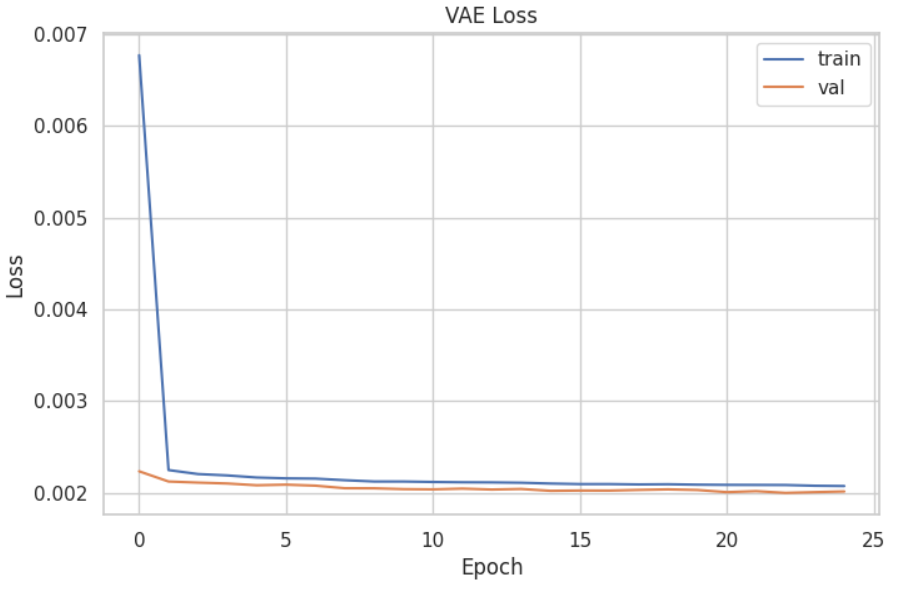
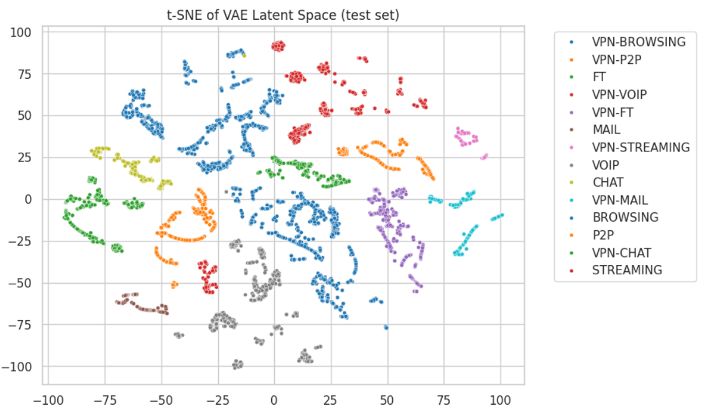

# β_CVAE_encrypted_traffic_ISCX2016

β-VAE on ISCX VPN-nonVPN traffic — learn a compact latent space from network flows, visualize with t-SNE, and classify traffic categories from the embeddings.

---

## What this does
- Train a β-Variational Autoencoder (β-VAE) to compress flow features into a low-dimensional latent vector.
- Visualize the latent space with t-SNE.
- Train two classifiers on the latents and report overall Accuracy / Precision / Recall / F1 (macro).

---

## Plots

  
  

---

## Classification on Latents (overall metrics)

| Classifier            | Accuracy | Precision (macro) | Recall (macro) | F1 (macro) |
|-----------------------|:--------:|:-----------------:|:--------------:|:----------:|
| RandomForest          | 1.00 | 1.00          | 1.00       | 1.00   |
| Logistic Regression   | 0.33     | 0.05              | 0.14           | 0.07       |

> Note: sklearn warned about undefined precision for some classes in Logistic Regression due to no predicted samples.

---

## Notes
- β controls the trade-off between reconstruction fidelity and latent structure; higher β can yield more separable latents.
- t-SNE is stochastic; set seeds for reproducibility.
